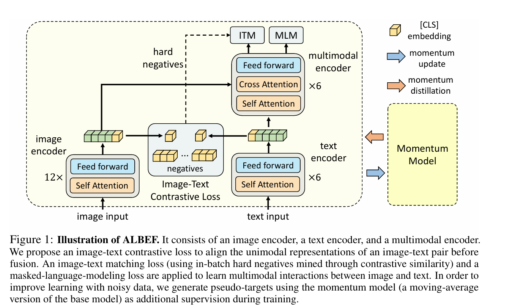
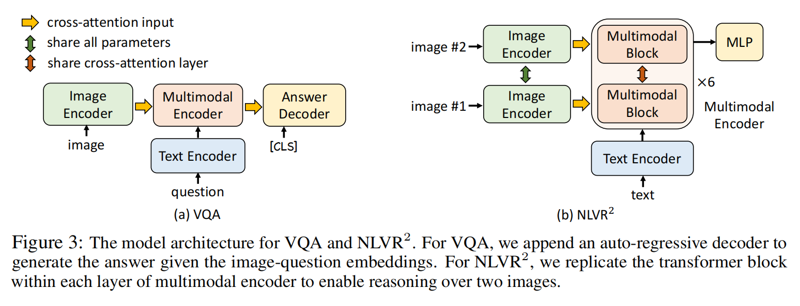

**ALBEF(Align before Fuse)**，先align对齐再fuse融合
../图片/ALBEF/
## 前言
读过CLIP的朋友知道我的头脑风暴，已经在这篇文章中实现了。

解决任务：
1. 不需要对图像有特殊的标注，例如特定物体的图像框，物体的标签，进而训练图像编码器（被证明有用，因为知道提取到了有用的信息）。文中改进了训练的办法。
2. 在一个高维空间中，我们有统一的想法，但是无法避免图像和文本天然映射到不同的向量空间之中，各自说各自的，在后面的交互过程中必然是有语义错乱，乱七八糟的。
3. 网络的数据有污染，如何降低训练时污染的影响。

## 技术细节

### 模型结构

#### 参数量设计
就模型输出文本来说（大多数模型的选择），从图像到文本比较从文本到文本，图像需要从像素点提取语义，才理解语义之后转换为文本，因此，图像部分需要更多的参数，这也是image input需要12层encoder的原因。

#### 对齐
images和text encoder都输出相应的向量，利用对应的\[CLS]标记输出的token，作为语义信息的载体（CLS token被认为收集了对应的信息，用来信息对齐）  
该对齐token用来和该batch之中的其他对齐tokens计算对比损失，细节就是images和text各有一个对比损失。

$$L = L_{ITC} + L_{ITM} + L_{MLM}$$

$$L_{ITC} = L_{images} + L_{text}$$

该做法被叫做对齐，用来维持图像输出的token和文本输出的token在同一个低维向量空间之中，在输入多模态transformer之中能够被统一处理。
#### 动量教师MoD
提出理由：
1. 网络训练数据嘈杂有污染，不一定全都是图片和文本相关。
2. 在对齐之中，可能有语义信息类似的CLS token被认为负样本，忽略了语义相关

教师模型维护的是模型参数本身，记录了当前模型和更新之后模型所有参数的加权平均值。针对于MLM和ITC等步骤，利用 **MSE损失函数** 来评估现有模型和动量教师的从差距并以此来计算损失函数。

该模型的逻辑是，模型减缓了对于不相关数据的惩罚，一定程度上增加了模型的泛化能力。

当然损失函数也要对应更新，这里不做阐述。

#### 多图片

当两个图片输入时候，image encoder和多模态encoder都要copy，并通过交叉注意力来联系起来。

### 可视化
为了探究不同的文本输入，模型实际在图片上有何反应，需要可视化。

输入single图片和文本时，模型会在交叉注意力部分计算之后输出。
我们可以通过导数（Grad-CAM）来得到图片不同像素对于输出的贡献，从而可视化重要性（热力图）。

## 头脑风暴

1. 模型对于多图片输入的支持不足，只能通过拓展模型架构，重新训练来适应。
2. 模型类似于BERT，使用了预训练+微调的办法，预训练使用了MLM和ITM，并不能适用few-shot或者zero-shot的先进理念。
3. 模型因为对齐的不足，使用了动量教师这个trick来缓解训练效果的不足。

### 更新方向

1. 能够同时适应有无图片输出的架构，并且支持多图片的输入
2. 更加通用的模型，类似于GPT3的few-shot能力，这就要能够兼容第一个点，这可能舍弃预训练+微调的训练策略，要求类似于GPT3的生成式模型，以文本为自监督数据。
3. 对齐一部是否有实际含义，是否能够简化模型，是否能够解释对齐的真影响。