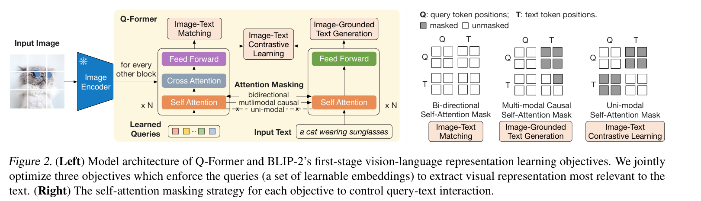
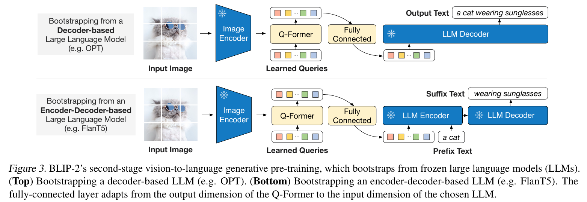

从BLIP2开始，我们的笔记将会直击核心，需要加速学习了。

## 前言
该文章的核心目的几乎和Flamingo相同，并且基本框架相同，都是利用冻结的图像和文本模型来构建多模态。

只是该文章改进了flamingo的信息生成和融合方式，相较于后者有参数和准确度的提升。

文章还改进了训练策略，使用了两个阶段的训练，分别是表征学习和生成学习两个阶段。

## 创新

### 结构

1. 同样是可以学习的向量作为图片的表征；首先在Q的注意力之后，与图像进行交叉注意力。
2. 将训练好的Q作为文本前缀，是一个软标签，改变模型结构。

这要求，训练的Q一定能够和文本对齐，充当文字！才可以作为文本前缀
### 第一阶段训练
这一步训练至关重要，关乎到图像信息能否对齐作为文本的表征来直接输入。

使用了三个训练策略
1. ITC
2. ITG
3. ITM

- 结构：文本的图像使用的注意力的权重共享，encoder看作编码器也看作解码器
- 共享的注意力权重，使得注意力对Q和监督文本的输入处理相同，如果语义相同，都能够进入相同的语义空间。这里是保证，**Q能够承载利用文字信息提取语义的功能。**
- ITC利用CLS Token的输出来计算相似度
- ITM（match）利用负样本来计算是否匹配
- ITG（generate）强制要求Q来提取出正确的信息

这里的ITG令人费解，既然不能让我们看到文本，那还要求Q提取出对应的信息，Q对应的可能是全局的信息，如何知道文本的 **下一个词** 呢？

### 第二阶段训练
训练一个从可学习Q到文字映射的过程。

Q的维度不是正确的，因为参数量的考虑，所以要加上一个全连接层，将它投射到文字的领域。

并不需要选择特定的文字，而是没有准确代表语义的向量作为 **软标签** ，在一定意义上代表文字，也能提供更多的信息。

## 头脑风暴

1. 对齐需额外训练数据
2. 对齐固然好，但是ITG设计的不合理
3. 软标签的输入有创造性，但是也给对齐提出了很高的挑战
4. 对于视频的处理欠缺（针对于Flamingo）
5. 依旧不满足我的先看文本再观察视频的顺序。

