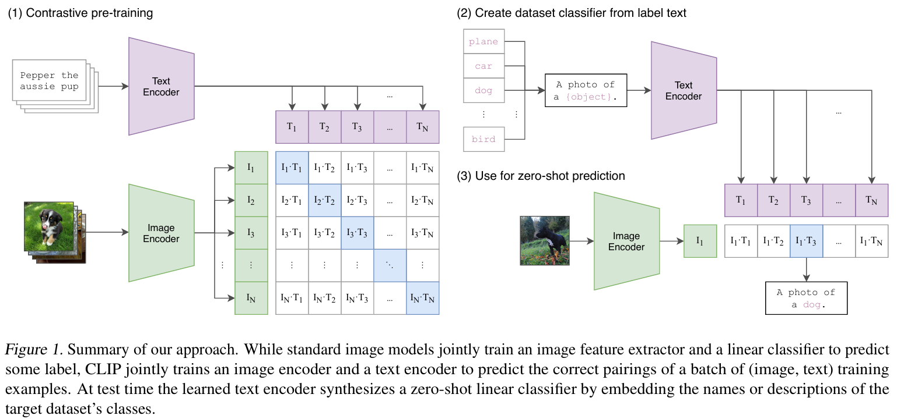

../图片/CLIP/
## 前言
在原始的图像处理之中，我们通常使用image-label对，来有监督得到一个分类器classifier。
读过GPT论文的都知道，现在最流行的模型是 **通用性的**，也可以理解为 **Zero-Shot**（现有模型只能预测学习过的分类，无法新知识上发挥作用）。

因此，作者致力于研究一个有足够泛化能力的图像理解器，而作者依赖的载体就是 **自然文本**。自然文本包含了大量的信息，如果能够引导模型输出靠近于文本，文本天生比标签（转换为数字之后的标签）多了很多语义。在这样的训练下，模型不仅能够学习到图像有什么，还能在无意中得到更多细粒度的信息以及一般化的信息。

上述做法也被叫做 **自然语言监督** 。

## 技术细节

模型思路来源：
在CLIP之前，以及有模型（词袋）利用文本监督来训练图像的表示，但是，文本是多种多样的，许多语言是针对于特定任务描述图片而来的，模型要准确的预测文本的信息，实在是太困难了。

作者监督学习文本的途径转向了 **对比学习**。  
通过多个文本的相关性比较，使用交叉熵损失，预测最相关的文本。同时能够对齐靠近正确文本的同时，排除错误文本。  
因此，自然的联想到，每个文本和图像都要输出为一个固定格式，文中输出为一个固定dim的向量。这个向量在高维空间表达了图像和文本的内容，利用向量乘积计算相似度。

### 模型架构
文本encoder和图像encoder，两个模块分别将输入处理成为固定维度的向量。

文本encoder可能利用句末标识符\[CLS] 来作为输出。图像VIT相同原理/CNN则抛弃分类头，FFN处理成为输出向量。

## 头脑风暴

### 针对于CLIP
CLIP给我最大的提示，就是高维向量的统一形式，但是还是存在以下缺点：
1. CLIP依旧是用于实际标签（在这里指的是文本）的 **配对任务**。原因在于，模型的双塔是一个高维向量，没有任何可解释性，仅仅用这些高维向量来计算相似度，只能完成配对任务。
2. 对于文本和图像的**信息表示过于简单**。为了模型能够计算对比损失，构造了一个高维向量来表示，我认为这局限了信息提取的能力。

### 多模态思路
1. 首先将文本和图像分别输入模型的思路没有错
2. **生成式相互监督**。利用文本来监督图像，由于文本具有不确定性，因此不能简单的计算相似度，而应该利用文本中的信息来**生成**图像，或者利用图像信息来生成文本；这能够看作模型理解了文本理解了图像，也不是抄袭。
3. **高维空间信息的交互融合**：继承第二点，为了实现生成的任务，应该将图像和文本信息提取之后，映射到**高维空间**之中，这些抽象向量表示了一段文本或者一个图像的**描述式信息**，在这个高维空间中，图像和文本表示的形式是相同的，互相能够看懂。

上述是我的思路，代表了我的态度：
1. 核心是所学的GPT模型：多模态模型应该是利用各种模态的信息，来生成我们想要的文本图像等。
2. 多模态的核心困难就是不同模态有不同的信息表示：因此我们致力于将不同信息表示为统一的形式，这个形式是多条高维向量。这是我认为的信息表示。
3. 在相同的表达形式之后，一个形式的信息能够作为另外一个信息的上下文，这个时候交互和融合就可以参照文本的处理。
4. 最终生成，我认为能够训练多个生成头，不同的生成头利用高维向量表示来生成不同模态信息。

