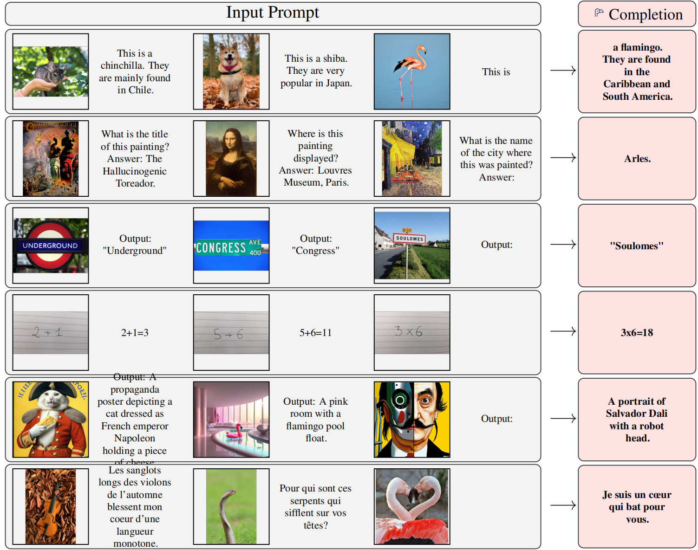
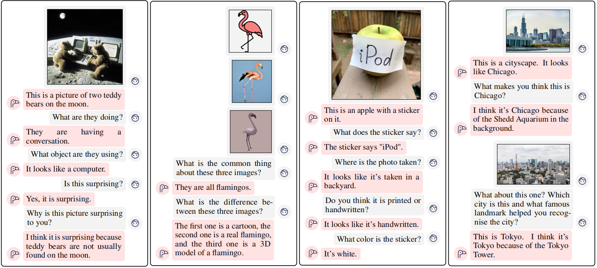
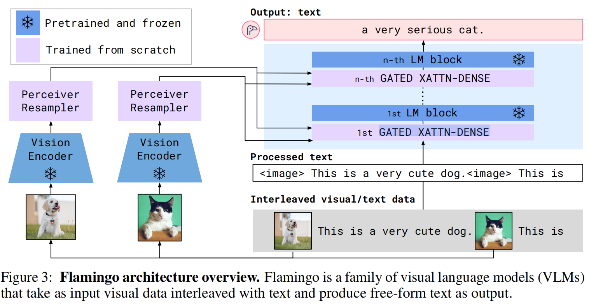
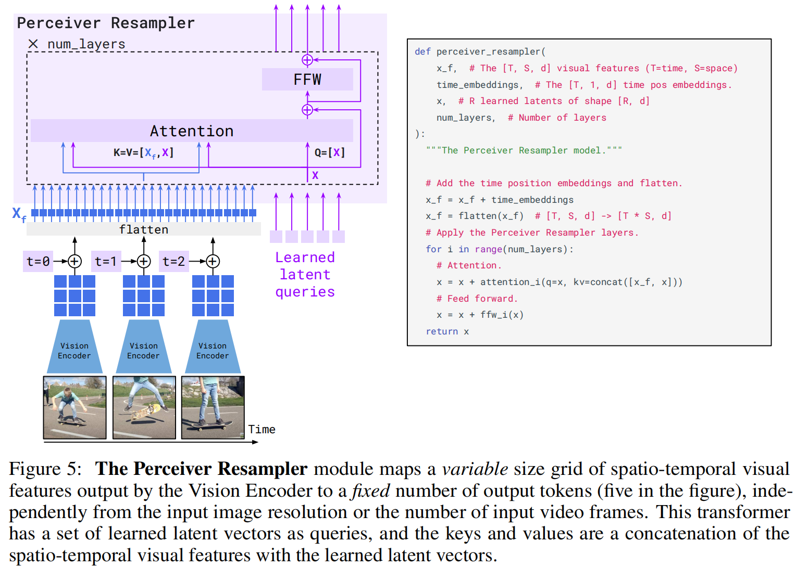
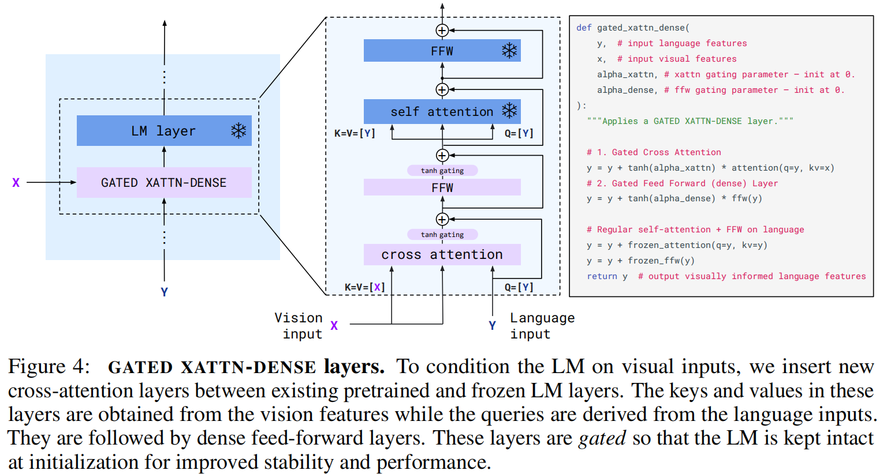
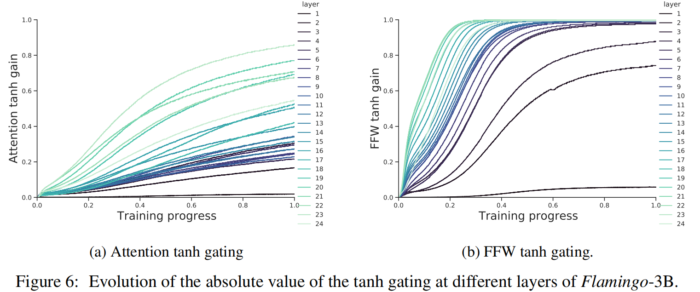

## 前言

解决问题：
1. 解决现有语言大模型和多模态模型的性能差距  ->  引入了**训练好的模型**融入到多模态模型之中
2. 解决图片和文本无法交替输入的问题
3. 能够输入图片和视频

模型直接聚焦于GPT3，想要学习他的few-shot或者one-shot能力，归根结底，作者想要他的模型能够具备理解信息，学习，推理的能力，而不是只能够处理现有范畴的知识。模型也自己说了，它是一个能够同时输入图片，文本，视频的自回归模型，将自己定义为多模态的Language Model。

现有模型能够有零样本学习的例如CLIP，又只能够计算相关性，价值不大。

few-shot实例：

该模型最终效果如下，符合我们现有对于对话模型的要求：

## 创新

### 冻结模型
模型引以为豪的，就是它能够做到高级 **拼接**。

这不是简单的模型拼接然后训练，而是能够直接利用现有已经训练好的大模型的参数，融合多模态数据，当然这个图片和视频处理的模型也是训练好的。

本文能够结合几个冻结的模型，一方面能够减缓训练压力，一方面能够使用现有模型的能力，不用太多的训练数据。

### 模型整体结构

简单阐述一下全流程：
1. 输入处理： 如果模型有输入图片，则将图片位置用`<image>` token替代
2. 图像处理：vision Encoder会输出理解文本的高维向量；之后输入P_Resample模块，它将高维向量转换为**固定长度，固定维度**的图像理解向量，用来输入language model
3. 融合处理：对于冻结的文本处理器，要选取特定的层来使用交叉注意力，融合多模态信息。最终文本输出。

下面需要介绍两个可训练的模块，就是串联不同模型的关键。
### Perceiver Resampler

1. 图像在encoder之后，输出的是一个小的图像，只有几个像素，需要展开之后输入；如果是视频，则每一秒选取一帧画面，在经过同样的encoder之后，展开输入模块
2. 在模块之中，Q向量是手动设计的，是可迭代的参数。作为Q，KV是图像的输入。因此，Q向量被认为是可以学习的向量。
3. 在通过注意力之后，FFN，就能够输出固定长度，维度的向量了。

这个向量Q可以理解为向图像提出的问题，图像的KV根据这些问题来输出向量，这些向量凝炼了整个图像的高维信息，在后续LM模型中被提取出来。

### GATED XATTN-DENSE

设计目的：
1. 在没有图像的时候能够正常处理文本
2. 在有图像的时候能融合图像信息

使用该模块替代原本的一个layer，原本的一个layer是LM layer。
而图像融合模块是新添加的，能够训练的，结构如下：
1. 交叉注意力，融合多模态信息：文本信息作为Q，图像信息作为K，V
2. 注意力输出通过FFN
3. **门控机制**：在训练时候初始化为0，随着训练的深入，门控通过反向传播逐渐调整，通过tanh限制在-1到1。门控机制被设置在交叉注意力和FFN之后。

门控机制必要性：都知道这是一个已经训练好的文本处理模型，如果直接添加图像信息，可能会直接破坏模型原有的连续处理信息的能力（体现在信息损坏，信息遗忘等方面）。因此为了保持原有的性能，要让模型能够逐渐训练从0到1的过程，逐渐能够适应图像的融合，实现**最小化入侵**。

## 头脑风暴
1. 冻结模型的行为，始终是太过于暴力，不接受任务形式的更新，尽管加入了gate来控制（这是一个很好的训练策略，非常聪明），还是多多少少会破坏信息。
2. 图像和文本不能保证在高维空间语义保持一致；但是模型中维持这个点的有p_Resample这个操作。
3. p_Resample输入的Q是可以学习的向量，Q有没有可能限制了凝练图像信息的能力。因为所有的图像都要输入相同的Q来处理，虽然Q有多个。我还是认为，对于图像的处理，始终是要对于特定任务来的，也就是说，**要接受了文本的信息之后，才能注意到图像需要注意什么方面。** 
4. 奇怪的掩码方式，复杂化了结构。（由于我觉得很不合理，所以并没有收录在文中。）

### 改进
我理想之中的模型，需要从文本之中提取信息，这一个隐藏层的信息作为Q向量，输入文本之中。
这个Q向量引导了图像encoder输出更相关的信息，这里需要注意力机制。
再加上一个模块，使得图像的输出和文本在高维空间上对齐。
对齐之后的图像输入，作为信息，再输入LM之中，进行模态融合。