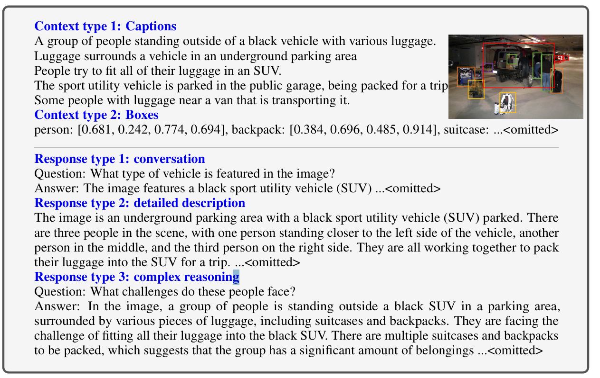
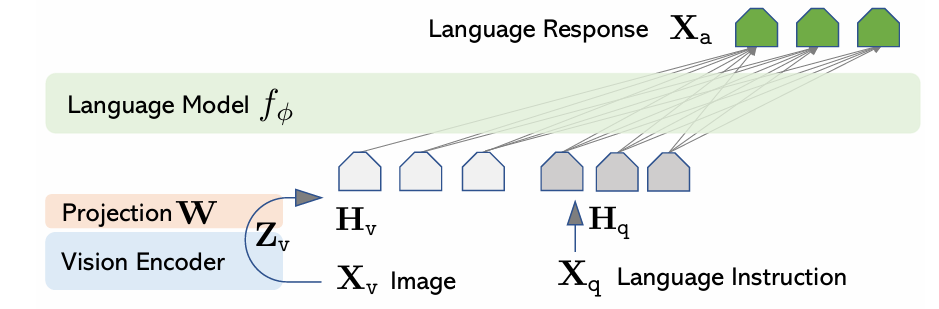

large language and vision Assistant

## 前言
本文基于GPT4指令微调的背景。作者认为既然InstructGPT和GPT4使用指令微调的效果那么好，那么我们多模态不能落下，我们也要多模态大模型能够正常回答人类的问题，而不是简单读后续写。（这一块可以看看指令微调）

然而模型遇到了一些问题
1. 多模态模型功能具有专一性（这是通用模型的老批判了） 
2. 缺乏数据——现有许多适合传统续写性模型的数据，例如image-text对，但是这并不能满足我们指令微调的要求。


## 数据生成
在当时还没有很好的多模态大模型出现，而GPT4是爆炸式的最好的大模型，但是不具有处理文本的能力。作者核心就是利用GPT4生成文本的能力来生成指令微调的数据。

作者使用的办法十分朴素：
1. 现有的image-text对能够很好地将一个图片描述成为文本，那就使用这些文本来假装为图片，并且添加一些特定物体的信息，使得信息描述更加详细，包含caption和box
2. 将**假图片**为给GPT4，生成被指令微调之后大模型的回答。分为三个模块，分别是对话，细节描述、复杂推理。

- 结果：
We collect **158K** unique language-image instruction-following samples in total, including **58K** in conversations, **23K** in detailed description, and **77k** in complex reasoning, respectively

## 模型结构


### 视觉编码器
原文采用"pre-trained CLIP visual encoder ViT-L/14"，原因是它具有强泛化性能以及多场景适用的能力。可知，他会在transformer之后输出一序列的output。

$$Z_v = VIT(X_v)\tag{1}$$

### 文本处理器
适用什么LLM以及不重要了，因为他的图文融合很抽象。


### 多模态融合
$$H_v = WZ_v$$

Hv能够作为假文本添加在LLM输入的开头了，这就是文章的图文融合方式。这个添加方式类似于BLIP-2的方式，仅仅是添加一个全连接，只需要少数参数实现融合，有点埋汰。。。

作者自己也说了，后续可以探索更加复杂的融合方式。

## 训练
模型从现在看上去，对齐是一个很大的问题，图像模型输出的东西不一定能被LLM接受，他们可能不在相同的高维空间之中。

全村的希望就是W了


### 多轮对话组织形式
1. **原始数据形式**：对于单张输入图像  $X_v$  ，生成多轮对话数据  $(X_q^1, X_a^1, \cdots, X_q^T, X_a^T)$  ，其中T为对话轮数,  $X_q^t$  是第t轮的用户指令（语言），  $X_a^t$  是对应的助手响应（语言，需结合图像生成）；
2. **指令序列构建规则**：为统一多轮对话的输入格式，第t轮的指令  $X_{instruct}^t$  按以下规则生成：
- t=1轮：随机选择  $[X_q^1, X_v]$  或  $[X_v, X_q^1]$  （即图像与首条指令的顺序随机，平衡模型对 “先图后指令”“先指令后图” 的适应性）；
- t>1轮：仅保留  $X_q^t$  （后续轮次无需重复输入图像，模型已通过首轮关联图像信息）；

最终的一个图片的训练数据
```text
X_system_message<STOP>
Human:X_ins_1 <STOP> Assistant:X_ans_1 <STOP>
Human:X_ins_2 <STOP> Assistant:X_ans_2 <STOP>
...
```
- 建模模型可以归结为：
$$P(X_a |X_{instruct} , X_{v})$$

也就是说，损失函数只需要计算`<STOP>`和`X_ans_i`。


### 特征对齐
冻结视觉编码器和文本处理器，单独训练W

### 端到端微调
冻结视觉编码器，更新W和文本处理器。