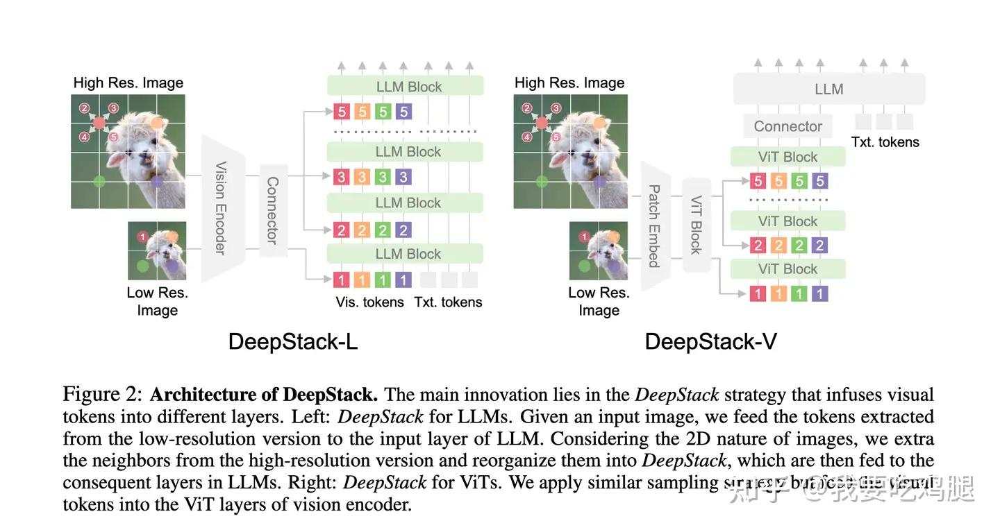
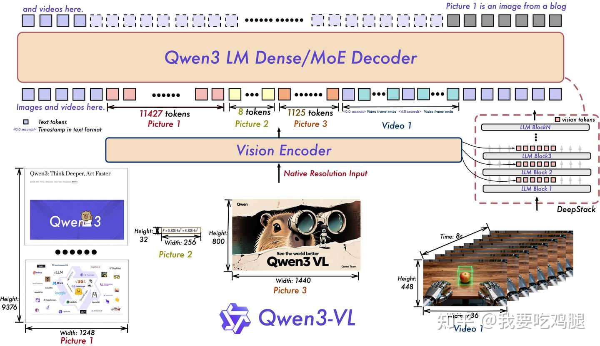
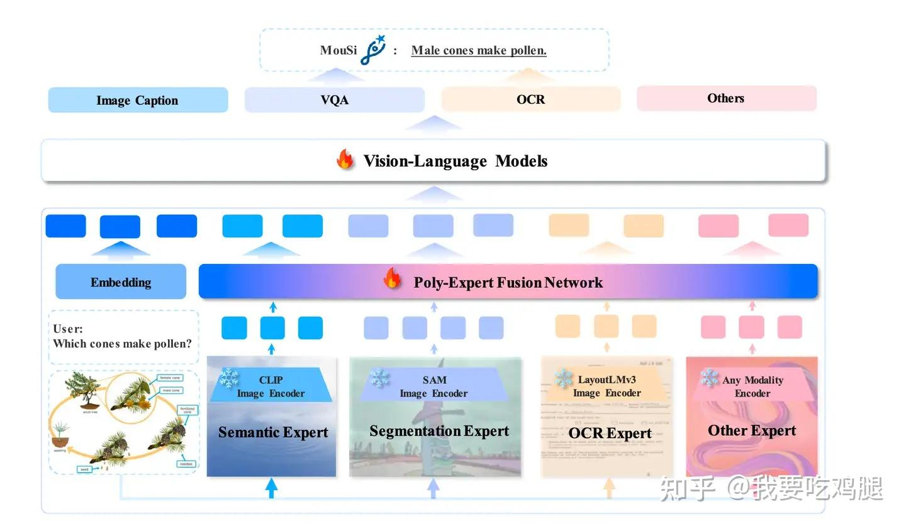

## DeepStack
我们可以使用类似于古早的CV/YOLO的思想，处理图像需要分为不同的细粒度，不同的细粒度代表不同层次的信息，从纹理，点和线到抽象的语义信息；从LM来看，低层次的信息告诉我们类似于哪里有线和点，像是描述性的信息，类比于LLaVA训练时喂给GPT4的文本框的信息，而高维度的信息更加类似于文字描述，标题信息，是带有强烈语义的。 **对图片编码更加精细化处理也是当前大模型使用多模态的主要发展方向。**

当然，这有两个角度来实现
1. 从CV角度，不同的细粒度就使用不从分辨率的图像，低分辨率的图像能够让模型忽略细节，快速学习语义，高分辨率反之。
2. 从YOLO角度，类似于特征金字塔，模型本身不同的layers就能够输出不同细粒度的信息，需要做的就是从不同的layer取出特征图，但是要保证输出格式一致。

下图给出了第一种CV角度，并更加详细分为VIT结构和LM结构适用。但是核心思想不变。我更加喜欢第二种：利用VIT块来编码，后面在输入VIT进行总体融合，VIT输出之后适用简单的Connector融合，融合非常简单高效；并且，使用VIT进行了编码和信息融合的两个步骤，非常统一。

## 改进DeepStack
先前存在缺点：
1. 需要得到不同分辨率的图片，不够简洁，并且需要额外计算量
2. 细粒度部分层依赖低分辨率的图像输出，但是忽略了高分辨率的图像同样能够输出语义信息，造成了信息冗杂和计算重复（直观上的）。

因此，后面VL改进
1. 信息编码改进：使用类似YOLO金字塔结构，不同layer输出不同细粒度特征图，不适用不同分辨率图像作为输入
2. 信息对齐改进：统一使用一个Vision Encoder，统一编码信息，这一块应该是分割之后使用VIT来实现的，才能够适应不同分辨率的图像。
3. 信息融合改进：flamingo结构->将vision Encoder的最终输出逐层输入LM，作为KV来融合信息

信息融合细节：
1. vision encoder中高层次的的信息当然是输入更深的LM
2. 如何输入最佳：实验证明，应该在LM的较低维度0-4维度实现全部特征图的输入，解释为LM的浅层用来整合信息，深层用来信息推理

## 拓展

从DeepStack角度看来MouSi，就会发现这是并行和串行的博弈。