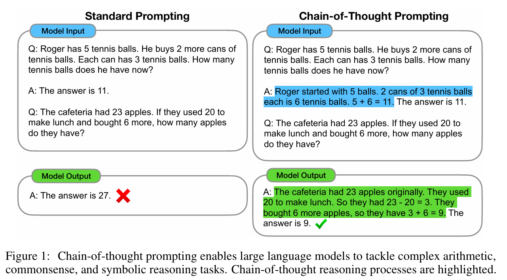
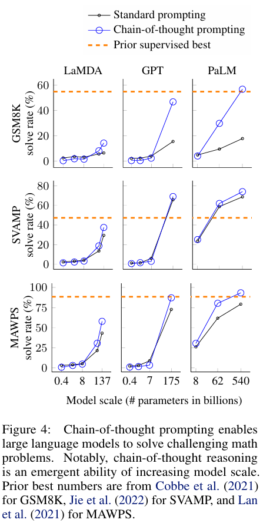
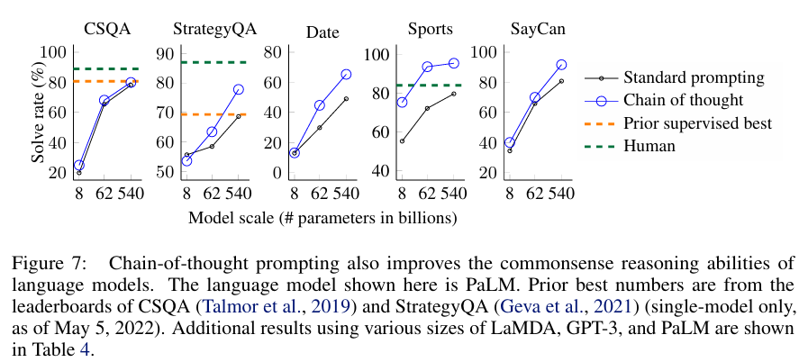

[Chain of Thought论文地址](https://ar5iv.labs.arxiv.org/html/2201.11903?_immersive_translate_auto_translate=1)
## 前言
同样提到，不断扩大模型并不能很好的适应当前大模型发展的趋势。本文致力于提高模型的 **推理能力**。

传统Tip：
1. techniques for arithmetic reasoning can benefit from **generating natural language rationales** that lead to the final answer.（算术推理技术可以从生成导致最终答案的自然语言理由中受益）
2. 大型语言模型提供了通过提示进行情境下少量学习的激动人心的前景

传统的办法一，需要大量的高质量微调数据。方法二，被证明随着模型参数量增大，性能提升有限。

本文融合了两种办法，并且规避他们的缺点：使用少量样本进行few-shot，但是样本的形式遵循
$$<input，thought，output>$$ 
## 创新

### CoT
利用数学应用题作为例子，数学题会有很多中间过程，并不是能够直接输出结果的。如果能够顺利写出中间步骤，然后逐渐推理靠近正确答案，问题就顺理成章解决了。从这个角度来看，如果能够训练模型**自然地输出推理过程**，通过推理过程输出正确答案，岂不美哉。

按照人类的头脑，简单看过一个复杂数学题之后马上算出答案是不可行的，因为我们没办法利用直觉直接得出答案，这是我们的能力局限，但是在我们拆分复杂问题，使用局限的运算能力和思维组装逻辑和答案之后，就能够算出答案。同理，**模型的逻辑运算能力局限**，如果未经引导，模型偏向于稀里糊涂的必须输出一个答案，就错，但是学会和人脑一样的思维流程，每一步都能使用模型已有的能力进行推理，不就好了。

意外收获：
1. 讲更多计算资源分配给问题
2. 能够可视化模型的推理过程
3. 任何人类能够通过语言思维解决的问题，理论上都能被模型解决

性能提升：

1. 对于小模型，提升不明显
2. 复杂问题，提升很明显
3. 超过了SoTA

### 有效原因
- 查看了测试集样本上的推理和正确性之间的关系
1. 在正确的样本上，推理完全正确
2. 在错误的样本上，五五开，50%是小推理错误，50%是重大的语义错误

但是经过进一步实验，在更大的模型上，50%的重大语义错误大部分被修复。所以可以总结为：模型在预训练之后具备了知识库和推理的能力，在此基础上，**限制模型回答能力**的因素有
1. 模型正常输出的语义理解和输出能力，这通过用更好的预训练模型
2. 模型推理问题的思路，这通过CoT的限制，模型能够很好地回答。

- 消融实验
1. only方程式。表明得到思维链方程式是比较困难的，这是一个具象到抽象的过程
2. 输出增多。通过简单的规定模型输出更长的思维链句子序列，来验证是否额外的输出导致了模型的优化。表明这个限制没有任何帮助
3. CoT After Answer。答案后添加思维链。表明没有任何帮助，直接说明了模型在中间过程中获得了帮助。

总结为
1. 模型本身的能力，也就是预训练知识。
2. CoT能够引导模型通过**自然语言**推理，逐步解决问题。-> 而不是仅仅方程式，计算资源增加。

### 鲁棒性
既然已经证明有效，那么接下来就要讨论实用性。也就是说，该办法是必须要专业的思维链引导，还是在多种情况下（提示的细节，例如语言风格，样例设计）都能够实现。

提示法的关键痛点之一是 “**对提示细节高度敏感**”（GPT-3 在 SST-2 任务上的准确率可因样例顺序不同从 54.3% 波动至 93.4%）。因此，思维链提示法需验证：其性能提升是否依赖特定标注者、特定样例、特定语言风格等 “不可控因素”。本节围绕多个关键变量设计实验，全面测试稳健性。

1. 不同标注者的提示：尽管不同标注者的思维链在性能上存在一定方差（符合样例提示法的固有特性），但所有版本的思维链提示法均大幅超越标准提示法。
2. **内容无关的提示**：来自于同一种任务的不同主题的提示。证明也有效。表明这种内容无关的CoT prompt能暗示模型按照正确格式输出。
3. prompt样例的数量：除了特殊任务之外，没有什么区别。
4. 不同大模型：在不同大模型上都有效果。

- 总结
1. CoT的prompt被证明具有很强的健壮性，模型能够通过输入的样例学会CoT的形式。
2. 对于一般的大模型都适用。
3. CoT能够提升性能并非偶然，而是普遍的。

附录表A1 讲述了参数和模型正确率的关系
D.2 展示了错误样例

### 推理
- 自然语言推理

- 符号游戏
效果不好，仅仅在大参数模型上起作用

## 收获
### 局限
1. 不能保证推理的路径正确
2. 不能保证模型真的推理。
3. 输出的token变多，花销变大。小模型能够适应CoT最好。

### 思考
1. CoT通过简单的引导，就能够极大提升模型的性能，超越了few-shot和微调。也就是：模型本身本来就有在预训练之后，获得很多能力。但是以往的模型 **限制了**模型的思考模式。
2. 有了这个办法，是否意味着，模型的语言功能越强大，CoT之后解决问题的能力越强大。扩大参数由成为一个唾手可热的方向？
