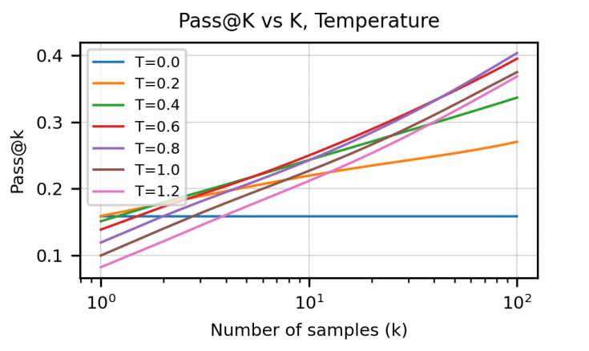
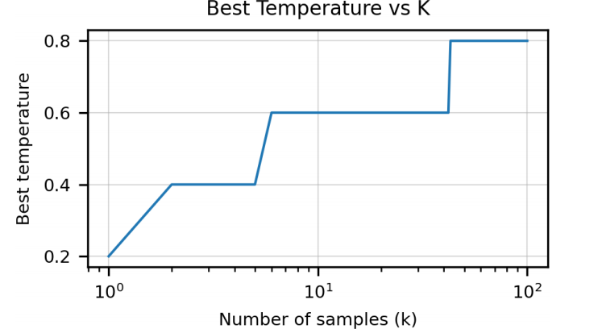
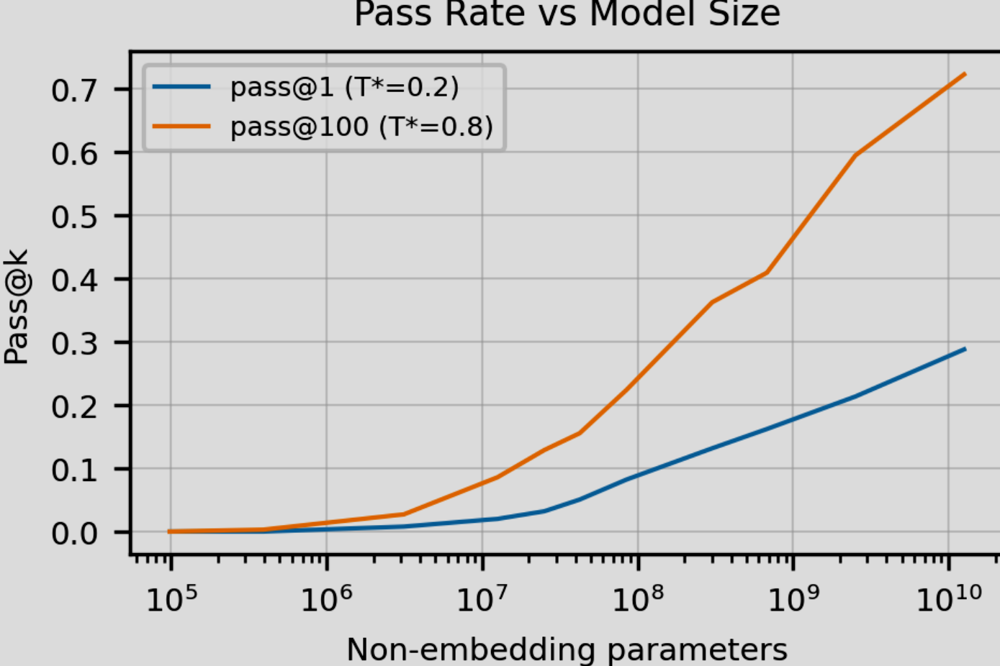
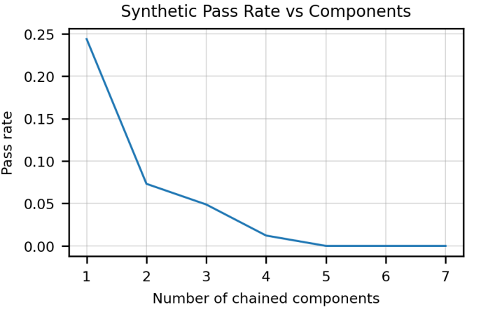

## 前言
主要就是在说，对于编程能力，意外发现GPT3有一定的编程能力，但是不多。这来源于庞大的训练数据和模型的推理能力。他们训练出一个更好的AI能够有更好的编程能力。

## 创新

### 评估体系
传统的BLUE只是表面的将目标文本和生成文本进行匹配，利用字面的匹配来计算文本的质量。所以好的模型就是能够成功匹配目标成本的模型。

但是在代码生成之中，**功能性大于匹配程度**，BLUE还不能进行语义匹配，逻辑匹配，所以可以需要新的评估方式。

- Pass@k
为避免因样本数量少导致的统计偏差，论文中采用 **“无偏估计**” 方法计算 Pass @k

具体步骤如下：
1. 生成样本：对每个问题，模型生成 n 个独立样本（n ≥ k，通常 n 远大于 k，如生成 100 个样本评估 Pass@10）。
2. 筛选有效样本：用单元测试验证每个样本的正确性，统计 n 个样本中 “通过测试” 的样本数量（记为 c，c 取值范围为 0 到 n）。
3. 无偏估计计算：当已知 n 个样本中有 c 个通过测试时，Pass@k 的无偏估计公式为：

$$\text{Pass@}k = \frac{1}{\binom{n}{k}} \sum_{i=\max(0, k - (n - c))}^{\min(c, k)} \binom{c}{i} \binom{n - c}{k - i}$$
其中，  $\binom{a}{b}$   为组合数（从 a 个元素中选 b 个的方式数）。

公式的直观意义：从 n 个样本中随机选 k 个，计算 “这 k 个中至少有 1 个通过测试” 的概率，再通过所有可能的 c 值加权平均得到无偏结果。

### 测试评估
文章给出了多种模型通过测试的评估办法
- single example：只产生一个样本，评估正确性
- multiple samples ：对于一个测试题目生成多个样本
	- 选择一个是正确的
	- 选择最高平均对数概率的样本作为评估

## 代码微调
在github上爬取的大量python程序，作为微调数据集。将空格特殊处理，省略了大量token。

实验发现：**直接预训练GPT**和**微调GPT**两种办法得到的性能差距不大，文章认为是代码数据集过于庞大，赋予了预训练GPT解决代码的强大能力。 但是，**微调GPT的收敛速度更快**，所以下面都使用微调的办法。

- 温度T和K的组合表现

- K对应的最佳温度

- 最佳温度0.2和0.8T和参数

## 监督微调

### 代码监督微调
为进一步提升模型在目标任务上的性能，研究者构建了 Codex-S 模型，具体内容如下：
- 训练数据来源
1. 编程竞赛网站：收集问题描述、函数签名和解决方案，转化为类似 HumanEval 的任务，创建 10000 个问题，覆盖多种算法推理能力。
2. 持续集成仓库：通过追踪集成测试中的函数输入输出创建单元测试，收集约 40000 个问题，聚焦基础功能实现，补充编程竞赛问题的分布。
- 数据过滤：使用 Codex-12B 为每个问题生成 100 个样本，剔除无样本通过单元测试的问题，排除模糊、过难或有状态的任务。
- 微调方法：基于 Codex 进一步微调，学习率为 Codex 微调的 1/10，采用相同的学习率调度，训练至验证损失平稳（约 100 亿 token），屏蔽提示部分的损失计算。

- 实验结果
1. 性能提升：Codex-S 在 pass@1 上平均提升 6.5 个百分点，pass@100 上平均提升 15.1 个百分点。
2. 温度参数变化：Codex-S 对 k>1 的情况偏好更高温度，因其建模的分布更窄。
3. 样本排序优化：基于平均对数概率的样本排序策略，Codex-S 的性能提升（11.6 个百分点）优于 Codex。

### 文档生成微调
该部分研究从代码生成文档字符串的反向任务，核心内容如下：
- 模型训练：基于监督微调的训练数据，构建 “函数签名 + 解决方案 + 文档字符串” 的训练样本，训练 Codex-D 模型以最小化文档字符串的负对数似然。
- 评估方式：人工评估 1640 个样本（每个问题 10 个样本），标准为文档字符串能唯一且准确地描述代码功能，忽略生成的错误单元测试，排除复制代码体的情况。

- 实验结果：Codex-D 的 pass@1（20.3%）和 pass@10（46.5%）低于 Codex-S，但表现相近。常见错误包括遗漏关键细节、受函数名误导生成无关内容。
- 样本选择应用：基于 Codex-D 的反向翻译策略（最大化生成样本到原始文档字符串的概率）选择样本，效果优于随机选择但差于平均对数概率策略，且易过拟合。

## 局限性

1. 训练了大量的数据（远超一个程序员一生能够接触到的程序），但是实际表现差于一个学习过编程的中学生。
2. 幻觉严重，容易生成语法错误的代码或者调用 **库中没有的函数**。
3. 极其难以处理长上下文，如图所示。

4. 胡乱使用变量；变量的属性搞错
