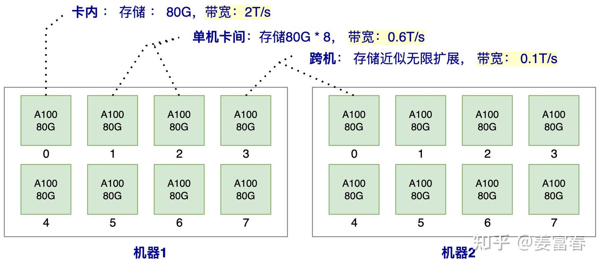
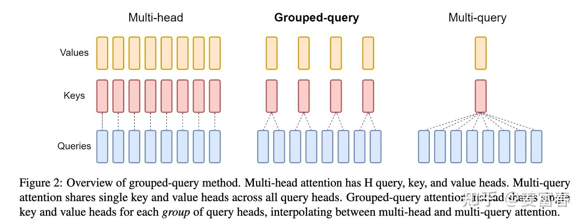
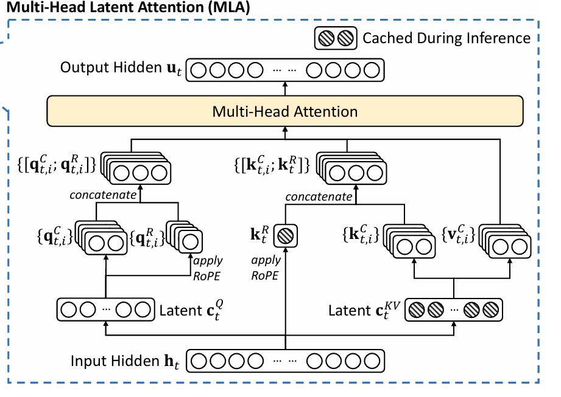

本文档记录了DeepSeek的模型改进，训练和数据集情况。
## MLA
参考资料：[绝世好文：知乎DeepSeek的MLA讲解](https://zhuanlan.zhihu.com/p/16730036197)

本章将在介绍MLA之前，顺带讲解背景知识：模型推理的显存占用，KV Cache，小部分矩阵乘法知识。

### transformer推理
- 问题来源：
$$[q_{t,1},q_{t,2},q_{t,3}...]=q_t \tag{1}$$
$$[k_{t,1},k_{t,2},k_{t,3}...]=k_t \tag{2}$$
$$[v_{t,1},v_{t,2},v_{t,3}...]=v_t \tag{3}$$
$$o_{t,i} = \sum_{j=0}^{T}{softmax(\frac{q_{t,i}k_{j,i}}{\sqrt{d}})\cdot v_{j,i}}\tag{4}$$
$$[o_{t,1},o_{t,2},o_{t,3}...]=o_t \tag{5}$$
上述就是transformer输出的计算公式
- K和V不受后面的计算影响
- 每一次计算o，都需要用到K和V，造成了重复计算

上述重复计算KV造成了推理效率下降，因此要解决重复计算KV的问题。最朴素的思想就是每一个K或者V计算出来都进行存储，就不需要重复计算了。这个思想就是KV Cache。

### 显存使用情况
下面引出了KV Cache存储的地方。

- 片上存储（SRAM）：所有的计算都要调度到SRAM才能做计算，通常只有几十M，但是带宽20T/s
- SRAM（CPU内存）：带宽速度很慢
- 显存HBM：一般模型的参数和KV都会存储在其中

### 推理过程内存使用
- KV cache
- 模型参数
- 运算过程中间数据：比如中间步骤的结果，一般即用即释放，不会考虑该显存

举个例子，加入模型使用Qwen-72B：
1. 80层，64Head，128维度，假设一个数只占用两个字节
2. KV:  $2*80*64*128*length*batch*byte=2.62MB * length *batch$
3. 单文本：length=2048，batch=1，得到5.3G
4. 多文本：length=4069，batch=32，得到343G
5. 模型本省参数14G
在实际应用中，batch比较少计算快，但是显存利用率不高，如果batch小，就会分配到多卡，带宽变慢推理速度下降。因此batch是一个平衡点。

### KV Cache
现在有三种办法，l为length长度，通过一层的参数量来对比
1. multi—head： $2*l*n$
2. Group—Q:  $2*l*\frac{n}{G}$
3. multi—Q:  $2*l$  

### MLA

- 公式
$$c_t^Q =W^{DQ}h_t\tag{6}$$
$$[q^c_{t,1},q^c_{t,2}...]=q^c_{t} = W^{UQ}c_t^{Q}\tag{7}$$
$$[q^R_{t,1},q^R_{t,2}...]=q^R_{t} = RoPE(W^{DQ}c_t^{Q})\tag{8}$$
$$q_{t,i} = [q_{t,i}^c,q_{t,i}^R] \tag{9}$$
$$c_t^{KV} =W^{DKV}h_t \tag{10}$$
$$[k^c_{t,1},k^c_{t,2}...]=k^c_{t} = W^{UK}c_t^{KV}\tag{11}$$
$$k_t^R = RoPE(W^{KR}h_t)\tag{12}$$
$$k_{t,i} = [k_{t,i}^c,k_{t}^R]\tag{13}$$
$$[v^c_{t,1},v^c_{t,2}...]=v^c_{t} = W^{UV}c_t^{KV}\tag{14}$$
- 保存变量：
1. $c_t^{KV}$  : 低秩分解之后，用来得到KV的向量，  $d_c = 4*d_h$
2. $k_t^{R}$  ：K的位置编码运算结果,  $d_r = d_h/2$

- 注意事项：
1. 计算  $k_t^R$  运用了MQA
2. 计算  $k_t^R$  运用了  $h_t$

- 内存占用
每一层使用了 4.5 个  $d_h$  ,  MQA使用了2个，原文中的  $d=64d_h$

### MLA矩阵解释
在注意力阶段q和k有

$$q_{t,i}^T×k_{t,i}=[q_{t,i}^c\ ;q_{t,i}^R]^T×[k_{t,i}^c\ ;k_{t}^R]= (q_{t,i}^c)^Tk_{t,i}^c + (q_{t,i}^R)^Tk_{t}^R\tag{15}$$
- 第一项:
$$=(c_{t,i}^Q)^T (W_{(i)}^{UQ})^T\ W_{(i)}^{UKV}c_{t,i}^{KV}\tag{16}$$
$$=(c_{t,i}^Q)^T W^{'}c_{t,i}^{KV}\tag{17}$$
1. 只需要保存c，c的维度是4d_h，少了16倍参数
2. （17）使用了 **矩阵乘法的吸收律**，这就是MLA的核心

- 第二项
1. 由（8）和（12）得到，他们进行了RoPE处理，不能和第一项一样使用吸收律处理
$$RoPE(W_q Q)^TRoPE(W_k K)=Q^TW_q^TR_q^TR_kW_kK=Q^TW_q^TRW_kK$$
这个R是位置敏感的，只能每一次重新计算，因此不适合使用吸收律。
同时，（12）的  $k^R_t$   维度为  $d_h/2$  是非常小的，我们直接存储该变量，因此

$$(q_{t,i}^R)^Tk_{t}^R=(c_{t,i}^Q)^T(W_{(i)}^{DQ})R\ k_t^R\tag{18}$$

### MLA优势讲解
- 内存占用（each layer）,单位是  $d_h$
1. MLA：  $c_i^{KV}$  ->  4.5  +  $k^Q_t$  -> 0.5
2. MQA:  KV  ->  2
3. MHA:  KV ->  2x16

- 推理速度
1. Q是正常计算的，不会影响 + K的R部分，直接存储，只需要添加RoPE编码
2. K的C部分，需要计算
3. V的C部分，需要计算

因此，相较于MLA来说，
1. 使用多样化的K，而不是共享（共享只适用于R部分），性能有所上升
2. 使用特殊的存储方式，而不是MHA，显存占用下降

我们可以说，
1. MLA保留了MQA的优点，对于R部分，采用了权重共享 + 改进：并且减少了该部分的维度
2. 保留了MHA的优点，使用多个KV计算 + 改进：利用低秩分解，利用少量计算时间来换取空间的存储

## MoE

### background
> 笔记的MoE讲解是我完成的第一个目录，现在回过头来看废话太多了，知识点讲的也不好。

MoE的专家面临两个问题，这也是所有的MoE模型旨在解决的问题
1. 专家不专， **知识混杂**：MoE的目的在利用不同的专家解决不同问题，进而提高性能。但是在训练的过程中不能保证一个专家会处理很多的问题，分散了专家的能力分配，是我们不想看到的。
2.  **知识冗余**：专家处理知识需要共同的知识，因此专家很多参数会收敛到相同的结果。

### 架构
- 针对问题二：文章提出了**共享专家**
一个朴素的思想，更多参数处理token会得到更好的性能。但是我们不希望知识混杂，专家要专门化。因此，我们使用共享专家，他们能够处理一些通用知识，是每一个token都要经历的专家。专用专家通过门控机制控制。保证了专用专家能够处理专门知识。为了保持通过专家数量不变，要减少专用专家的挑选数量。

- 专家数量增多：专家维度减少为原来1/m，专家数量增多m倍。参数不变的同时增多了专家数量。

### 负载均衡
1. Expert级别辅助函数：使得每个专家分配到的个数相同
$$L_{exp} = \sum_{e=1}^{E}{f_eP_e}$$
$$f_e=\frac{路由器专家数量}{每一个路由选择的专家数量} * \frac{该e专家被调用的次数}{所有专家被调用的次数}$$
$$P_e=\sum_{i=0}^{I}{\frac{每一个token的概率p_i}{token数量I}}$$
2. 设备级别辅助函数：使得设备之间分配的token个数相同，从Experts层面平衡，同时还能够设备之前的不均衡。具体原理和上述（1）相同，只是讲最小单元变为一个group。
3. 专家容量，超过专家容量直接计算残差连接。

### 负载均衡（V3升级）
1. SoftMax函数改为 Sigmoid：使用sigmoid可以允许模型在更大的专家集合上进行选择，而不像softmax函数倾向于将输入分配给少数几个专家（有严格排序）。
$$h^{'}_{t} = u_t + \sum_{i=1}^{N_{share}}FFN^{(share)}_{i,t}(u_t)+\sum_{i=1}^{N_{router}}g_{i,t}FFN^{(router)}_{i,t}(u_t) \tag{1}$$
$$s_{t,i}=Softmax(u^T_{t,i}e_{t,i})\tag{2}$$
$$p^{'}_{t,i}=
\begin{cases}
s_{t,i}& {s_{t,i}∈{TopK}}\\
0&\text{otherwise}
\end{cases}\tag{3}$$
$$p^{'}_{t,i} = \frac{p_{t,i}}{\sum_{j=0}^{N_{router}}{p_{t,j}}}\tag{4}$$
2. **过大的损失函数损害了模型的性能**，因此V3抛弃了前面的辅助函数办法。b初始化全部相同，在后续训练中，如果负载不均，则对相应的权重b增加或者减少 **γ**大小来调整。不用反向传播，而是通过动态调整阈值来控制。
$$p^{'}_{t,i}=
\begin{cases}
s_{t,i}& {s_{t,i}+b_i∈{TopK}}\\
0&\text{otherwise}
\end{cases}\tag{3'}$$

3. 在序列维度添加辅助损失函数，防止一个序列极端不平衡情况发生（我也不知道为什么），计算过程和前面原理相同。

## GRPO

