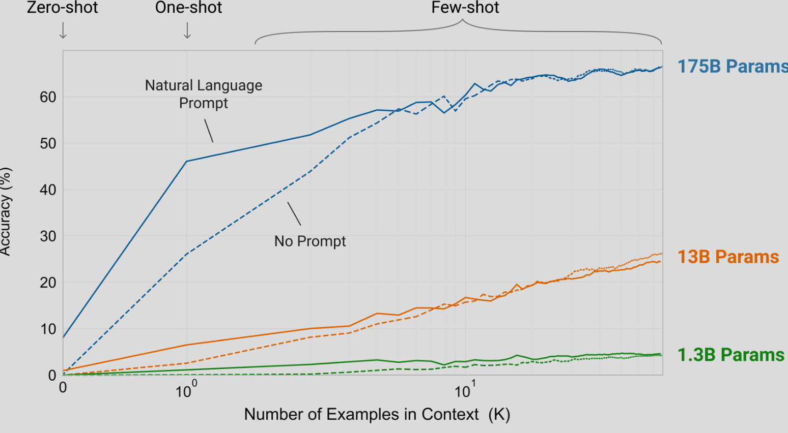
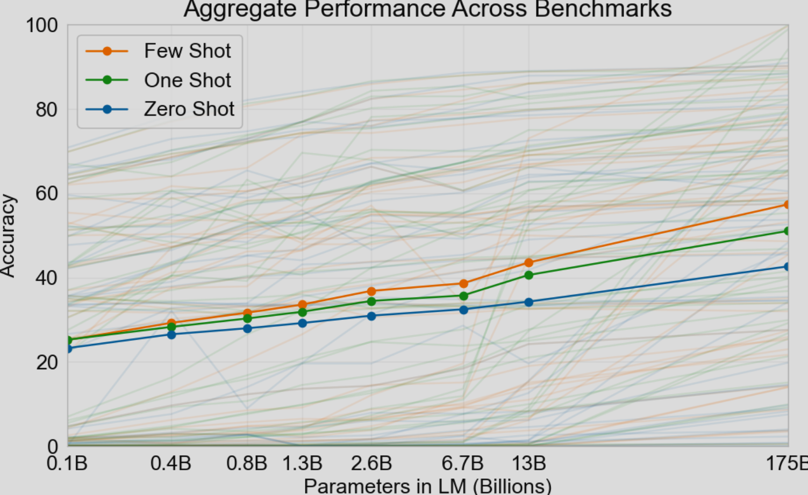
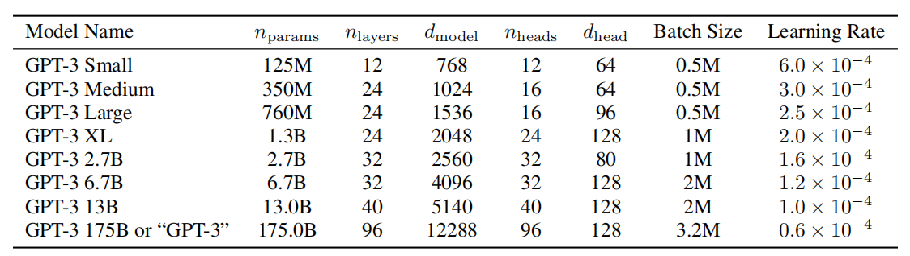
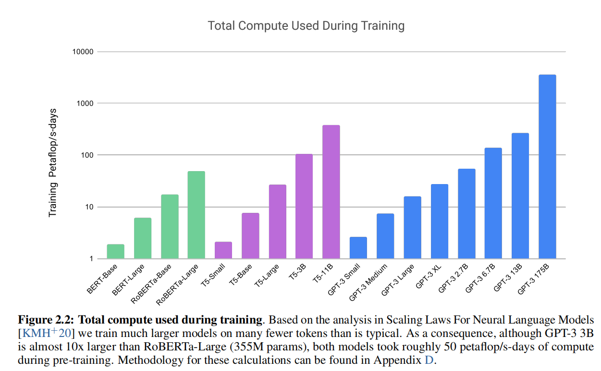
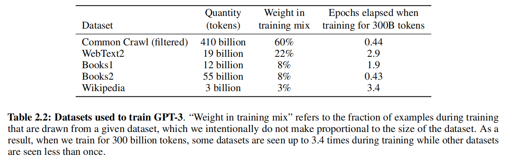
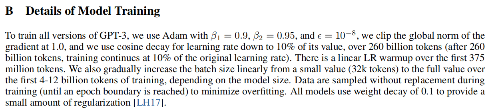
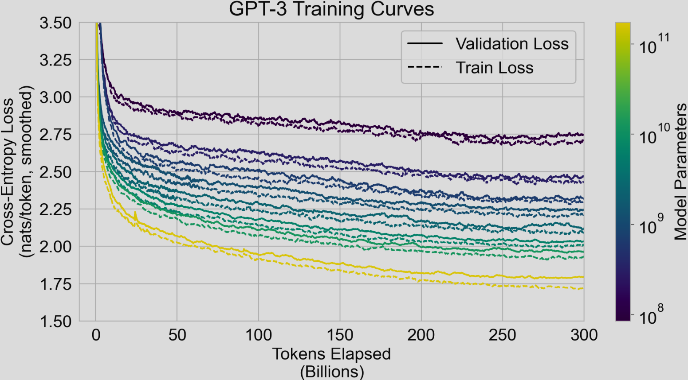

## GPT-2

文章提出，现有（2019）的机器学习，普遍都是监督式的，需要庞大的训练数据，每一个模型都是一个任务的专家。
例如针对翻译，情感分析，完形填空。
然而，本文认为，需要一个**通用式的模型**，并且认为，针对特定任务训练的模型泛化能力弱。

> 这指明了BERT这些模型的通病，就是针对特定任务训练的模型，模型内部参数必然会向着解决任务靠近，对于通用语言的内部逻辑学习，可能有所欠缺。

**多任务学习**（BERT的预训练策略）在当时也被证明无效。
解释为：
1. 如果学习到了通用的内部逻辑，那么就不需要在新的任务上花费**大量的训练数据**
2. 在迁移学习新的任务时，模型会对原来的内容发生**灾难性遗忘**。
因此，多任务学习并不能培养出通用学习者.
同时，也有一项疯狂的在10个任务上训练的模型，被证明有提升，这也说明了，**需要大量的数据**这个缺点。

文章给出的模型，能够学习通用的语言逻辑，通过**text+question**的输入，**无需监督训练**，完成下游任务

### 创新
传统的有监督学习模式为

$$P(输出 | 输入)$$
如今在通用的模型之中，**任务同样能够作为语言输入**

$$P(输出 | 输入，任务)$$

#### 数据集
创建了WebText数据集，包含800w个文本

#### 编码
采用BPE，避免传统处理OOV，大小写转换带来的限制模型可处理字符串范围的问题。

改进BPE：
1. 传统BPE合并字符，会对空格进行替换处理，这里将空格也作为一个输入
2. 传统BPE不对符号敏感，生成类似`g?` 的合并规则。文章中使用了 **类别限制** ， 句号感叹号等符号一类，字母一类，空格一类。**符号一类不能合并，空格和字母能够合并**。
3. 传统的BPE通常会包含unicode的单词词库，使得初始化的词库非常庞大（10w以上），这里舍弃了该做法，完全在数据集上训练得到合并规则。

#### 模型
继承了解码器的结构，改进如下：

原模型：使用post-LN，在输出之后层归一化+激活函数，目的是输出能够看作单词
改进：将LN提前到输入端，意味着不看重模型输出是否能够解释，反而保证输入层的**分布**保持不变，不会有协变量偏移（在LN之后经过激活值，激活可能改变方差和均值） ; 在**最后一个交叉注意力**之后再加上一个LN，使得输出能够作为单词，能被解释。

| 规模     | 参数量   | Layers | d_model | n_head | d_ff   | context_length | Dropout |
| ------ | ----- | ------ | ------- | ------ | ------ | -------------- | ------- |
| small  | 117M  | 12     | 768     | 12     | 4*768  | 1024           | 0.1     |
| medium | 345M  | 24     | 1024    | 16     | 4*1024 | 1024           | 0.1     |
| large  | 762M  | 36     | 1280    | 20     | 4*1280 | 1024           | 0.1     |
| XL     | 1542M | 48     | 1600    | 25     | 4*1600 | 1024           | 0.1     |

### 损失函数

$$L = -\frac{1}{N} \sum_{i=1}^{N}\log(p\left(s_i | s_{i-1} ...s_2,s_1)\right)$$

目的是在数据集文本之中，最大化正确预测词的概率-> 最小化损失函数

### Top-K
Top-k 是一种 “截断式概率采样” 策略，核心是**先筛选高概率候选词，再在候选池中随机采样**，避免低概率 “垃圾词汇” 被选中，同时保留多样性：
1. 对 SoftMax 后的概率分布，按概率从高到低排序，选取前k个 token 组成 “**候选池**”（k为预设超参数，其余低概率 token 直接排除）；
2. 对候选池内的 token 概率进行 **重新归一化**（确保候选池内概率总和为 1）；
3. 从重新归一化后的候选池中随机采样（高概率选到的概率比较大，尊重SoftMax结果）一个 token，作为下一个生成的 token

### 困惑度
$$PPL = \exp\left(-\frac{1}{n} \sum_{i=1}^{n} \log\left(p(s_i | s_1,...,s_{i-1})\right)\right) $$

## GPT-3
文章及其翻译[GPT3文章翻译（网页版本）](https://ar5iv.labs.arxiv.org/html/2005.14165?_immersive_translate_auto_translate=1)
### 前言
文章依旧强调无监督学习的重要性，并且认为，
1. 在大量数据上预训练的模型，经过微调之后限制了模型的泛化能力
2. 人类不需要调用特定模型来解决特定问题，需要一个更加通用的模型能够解决不同的问题。
文章将学习语言通用逻辑，叫做 **meta-learning 元学习**，下文我们采用该说法。

现有的困难是，虽然元学习有诱惑性，但是与大规模有监督学习模型相比，性能还是落后比较多。
而将元语言运用在特定任务上，提升性能的做法，就是**few-shot或者one-shot**，也就是在输入的上下文之中，给出用文本书写的具体案例，让模型学习案例逻辑。

图一展示了三个规模的模型，性能随着学习样本的改变。可以看到
1. 提示词对于零样#本学习的引导性作用
2. 更大的模型更加能够学习到样本之中的逻辑，展现出更好的性能。

图二展示了随着模型规模的增加，样本学习对于模型性能影响
1. 更大的模型对于样本的学习能力更强，表现在相同的样本下模型性能提升更明显。

文章的核心假设：
**模型的对于样本的学习能力，随着模型的规模增大而增大。** 

文章会从几个新的任务，评估模型在单样本，少样本和零样本情况的情况。

### 方法
由于GPT3在模型架构上没有大改变，所以下面的章节将会重点讲解在各个领域训练的改进。
值得关注的是少样本，单样本，零样本学习在GPT上面的表现，这将会在**结果**一章之中表现。
#### 模型和架构
- 核心改动
模型为了解决参数巨大的问题，使用了密集注意力和**带状稀疏注意力**在layers之中交替。

- 参数

按照核心思想，作者设计了上面几个规模的GPT，参数和训练数据如上，每一个模型都训练了3000亿个token。

- 训练策略

这是训练时间，作者特意提到他的**训练策略**：**大模型+少样本** 。
这是为了和RoBERTa-large作比较。因为GPT3-3B参数量是其10倍，但是训练的时间相差不大。原因在于传统训练使用了 **小模型+多样本**。

| 模型            | 参数数（N） | 训练 token 数（T） | 计算量核心逻辑（≈3×N×T）                                          |
| ------------- | ------ | ------------- | -------------------------------------------------------- |
| RoBERTa-Large | 3.55 亿 | 约 1.6 万亿      | 3×3.55e8×1.6e12 ≈ 1.7e21 flops（≈50 petaflop/s-days）      |
| GPT-3 3B      | 30 亿   | 3000 亿        | 3×3e9×3e11 ≈ 2.7e21 flops（≈50 petaflop/s-days，因架构优化略有抵消） |

#### 数据集

作者提到  “**非比例抽取**”  做法：数据集的大小不和被训练的权重成正比。这意味着：有一些数据在一个epoch之中会被训练到高达3.4次，有一些数据在可能在epoch之中不被训练到。这可能代表了作者对于AI训练数据的偏好（更希望AI训练的朝向）：

表格中WebText2、Books1、Wikipedia 属于 高质量数据，被赋予更高权重和更多遍历次数。而Common Crawl即使经过过滤之后，仍有许多低质量的数据。

#### 训练细节

文中有模型对于学习率，优化器，正则化，batch，梯度裁剪的细节。

> 还有作者对于序列长度的处理，避免了不必要的掩码麻烦。

在训练过程中，我们始终使用完整的、包含  $n_{ctx}=2048$  个令牌（token）的上下文窗口（context window）对序列进行训练；

当文档长度小于 2048 个令牌时，**会将多个文档打包到一个序列中**，以提升计算效率。
包含多个文档的序列不会采用任何特殊的掩码（masking）处理，相反，序列中的各个文档会通过一个特殊的 “文本结束令牌”（**\<end of text token\>**）进行分隔 —— 这一设计能为语言模型提供必要信息，使其可推断出：被文本结束令牌分隔开的上下文之间不存在关联。这样一来，**无需任何针对特定序列的掩码操作，就能实现高效训练**。

### 测量记忆benchmark
benchmark是评估大模型性能的一系列标准化任务、数据集。
在论文中利用各种benchmark来对GPT的模型进行评估，在原文花了大篇幅讲解，这里不做记录。但是不免提出一个问题：GPT的训练数据集如此庞大，并且模型参数如此多，如何保证 **模型是学习，而不是死记硬背呢**。也就是说，训练数据可能和benchmark的测试集重合了，模型通过记忆而表现得很好。
上述的现象可以被成为 **数据污染** 。

- 一个指标是在训练的时候查看测试和训练的损失表现

1. 在训练集和测试集上表现相差不大，证明模型偏向于学习而不是背诵
2. 损失曲线下降正常，参数量最大的模型甚至没有达到最佳的损失函数，也就是还处于**欠拟合状态**

#### 量化数据集污染
作者设计了 “**清洁数据集**（clean subset）对比法”，通过 “对比模型在‘完整测试集’与‘无污染清洁集’上的性能差异”，判断污染是否影响结果。具体步骤如下：
1. 构建 “清洁数据集（clean subset）”
对每个基准测试集，先定义 “**污染示例**（dirty example）”：
若示例长度≥13 个词：存在任一 **13-gram** 与训练集重叠，即为 “污染示例”；
若示例长度 < 13 个词（如单词重组任务）：用 2-gram 检测重叠（避免短片段误判）；
“清洁示例（clean example）”：无任何上述重叠的示例，即模型训练时绝未见过的内容。

2. 性能对比逻辑
若模型在 “清洁集” 上的性能 ≈ “完整集” 上的性能：**说明污染无显著影响**（即使有重叠，模型也未靠记忆得分）；
若模型在 “清洁集” 上的性能显著低于 “完整集”：模型靠记忆污染示例得分。

3. 方法优势
区别于 “仅检测是否有重叠” 的传统方式，该方法直接量化 “污染对性能的实际影响”，避免 “过度恐慌（有重叠≠有影响）” 或 “忽视风险（无重叠≠无问题）”。

#### 未来建议
基准设计：未来测试集应**避免**直接使用互联网公开内容，或明确标注 “来源” 以方便去重；
模型训练：需更完善的 “**训练 - 测试重叠检测工具**”（如语义级去重），而非仅依赖 n-gram；

### 局限

表现局限性：
- 长文本中失去记忆
- 句子不连贯，没有意义
- 欠缺常识
- WIC 和 ANLI这类的任务（判断两个词在句子中是否以相同的方式使用，或者一个句子是否暗示另一个句子）

 算法局限性：
 - 没有使用BERT的MLM任务，能够训练模型看到上下文；也没有使用T5的去噪训练目标，导致聚焦于下一个token生成，对上下文理解不深。
 - 无限扩展模型的老路可能终有尽头，需要寻找新的变强办法（新架构）
 - 对于所有**token都一视同仁**，但是在人脑中会区分实词和虚词（这不是一个好思路）
 - 只局限于文本数据，没有机会接触到视觉听觉（需要多模态）
 - 只能文本输入输出，无法有行动，就是调用工具（AI agent）
 - 预训练花费大量数据，效率相比人类低得多。

