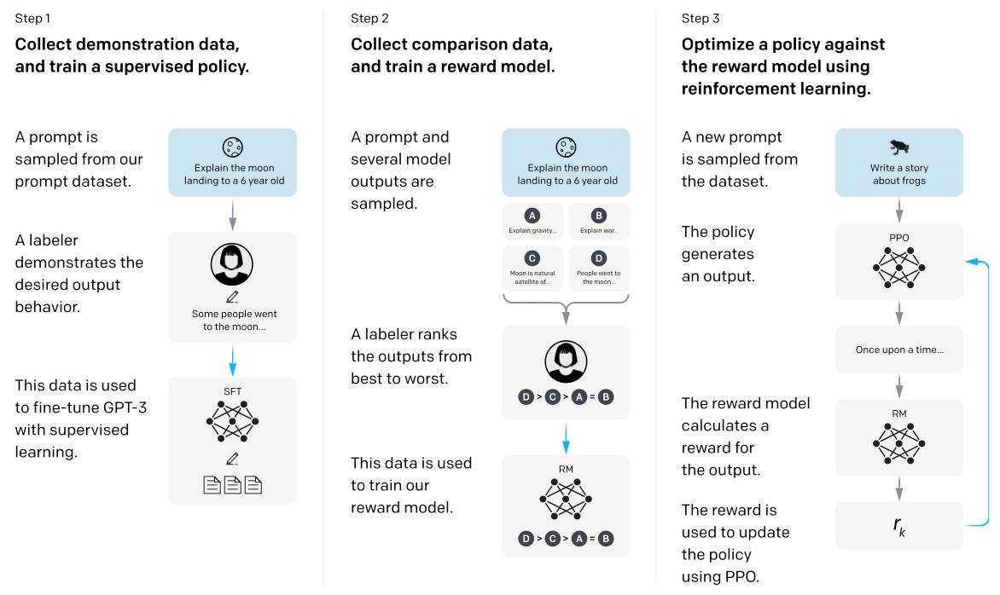
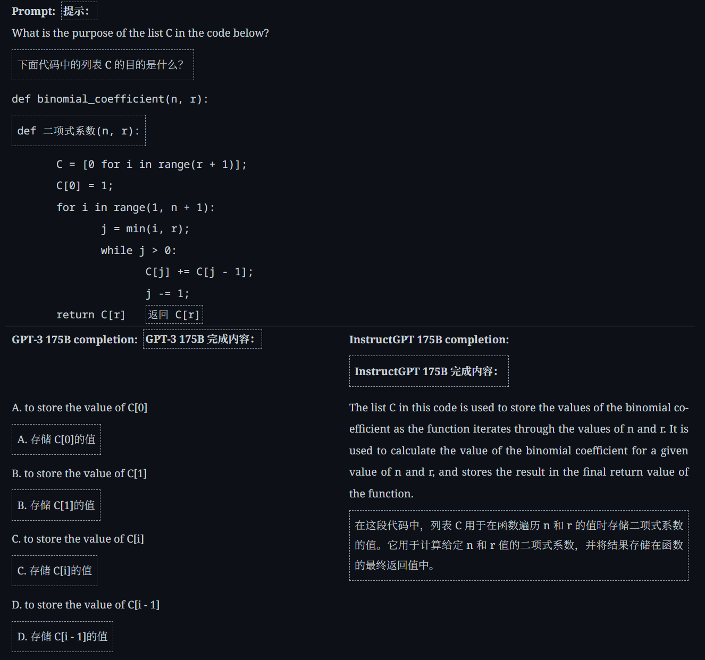
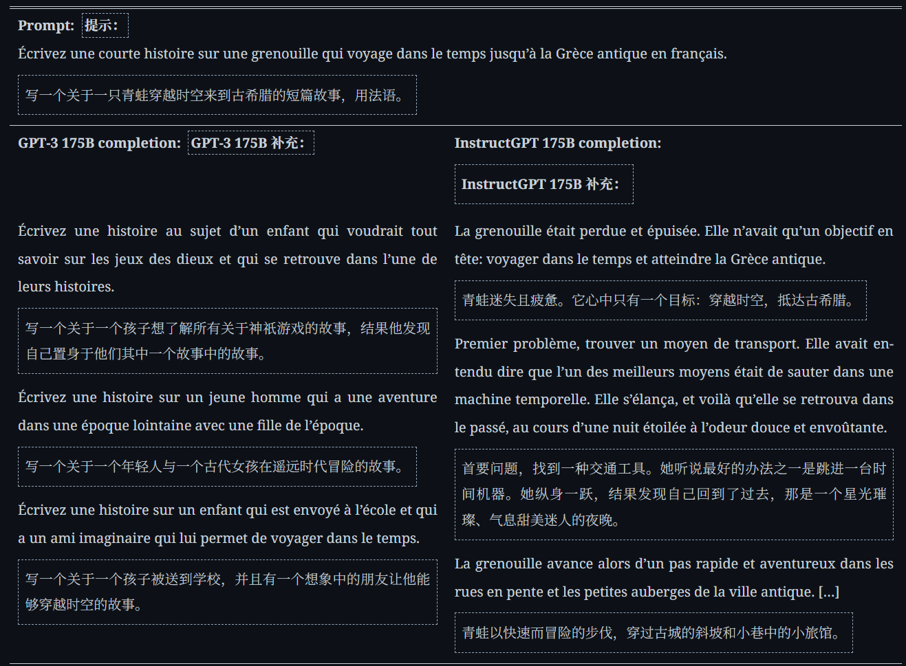
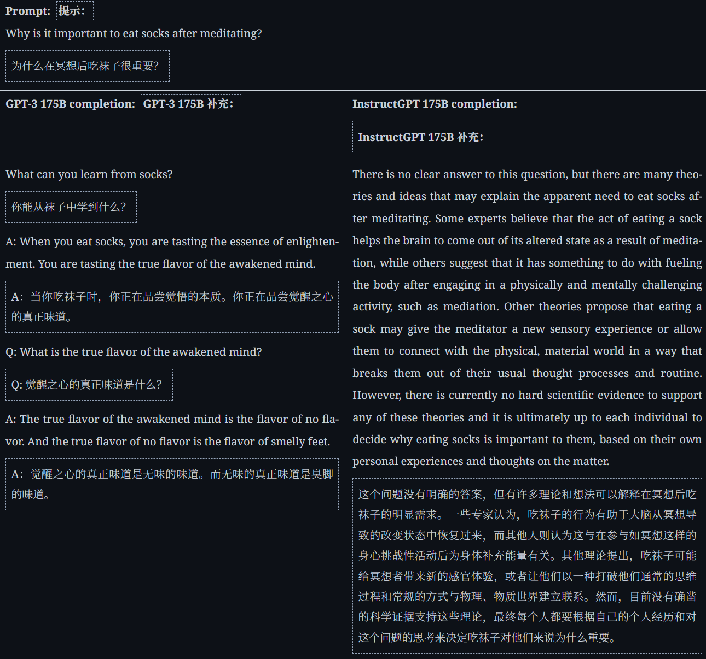
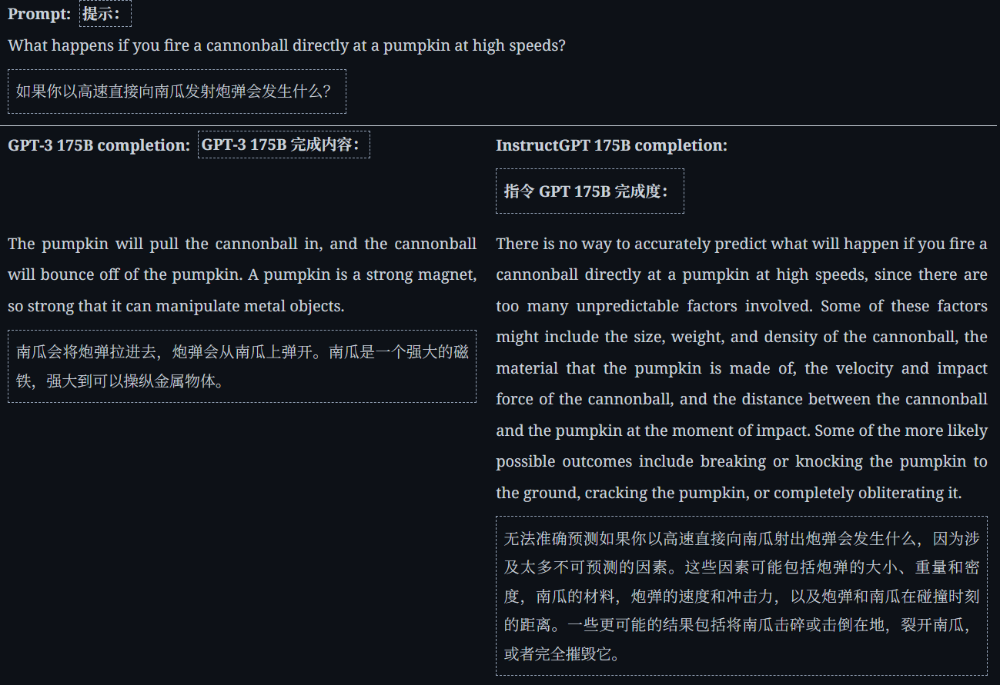

## 前言
模型越来越大可能意味着模型的性能越来越好，但是无法保证模型能遵循用户所需要的内容来输出。例如可能生成一些幻觉的玩意。

实际上，文章说这来源于 **训练的错位**，因为训练的目标是从网页中爬取数据，在数据上预测下一个标签，更倾向于读后续写，与我们期望的“对人类有益的回答”是错位的。

文中提出了，**使用人类的反馈来微调模型**。在小参数的模型上超过了多其一个数量级的模型。

文章的目的：使得模型能够做到
1. **helpful** (they should help the user solve their task),
2. **honest** (they shouldn’t fabricate information or mislead the user),
3. **harmless** (they should not cause physical, psychological, or social harm to people or the environment).

## 方法

总体的训练策略：
1. 人工收集数据：问答和偏好
2. 使用问答来微调GPT
3. 训练一个模型RM，拟合人类的输出偏好
4. 使用RM模型的输出作为标量奖励，使用PPO算法奖励模型来输出人类偏好输出。

### 数据集
**数据集来源：**
1. OpenAI寻找了一个团队并测试了团队成员的能力。接着根据一些已有的指令，**团队手动撰写了符合要求的回答**。这些问答将作为监督学习的数据。
2. 在原始的InstructGPT API background中的用户，收集用户的**文本交互提示**。

**数据分类**：
- **plain** ： 成员自己给出多样化的任务，并自己回答。
- **Few-Shot** ： 用户给出一个指令，并自己写几个问答对。
- **User-Base** ： OpenAI成员自己拟定一些指令，要求成员编写。

**特殊要求**：在专业团队的数据之中，除了被要求上面的三种数据之外，
1. 还被要求 **推测用户输入的真实用途**，例如一些偏见（根据OpenAI的要求），暴力，并作出相应正确的回答（可能是拒绝回答）。
2. 对于摸棱两可的prompt，标注人可以拒绝回答。（可以减少幻觉）。

最终得到的数据：

| 数据集类型   | 核心用途                                  | 数据来源               | 规模（训练提示数） |
| ------- | ------------------------------------- | ------------------ | --------- |
| SFT 数据集 | 训练监督学习基线模型（Supervised fine-tuning 模型） | API 用户提示 + 标签员编写提示 | 约 13k     |
| RM 数据集  | 训练奖励模型（RM），用于预测人类偏好                   | API 用户提示 + 标签员编写提示 | 约 33k     |
| PPO 数据集 | 作为强化学习（PPO）的输入数据，用于微调 SFT 模型          | 仅 API 用户提示         | 约 31k     |

### SFT模型
Supervised fine-tuning
训练16epoch，**在数据集上过拟合**，[^1]  但是过拟合之后对于RM模型的训练和偏好人类输出有益。

### RM模型
首先我们需要明确强化学习之中的这个小概念。强化学习需要反馈来获得更好的模型，传统的办法是人工给与奖励，现在是利用机器学习训练出一个能够拟合人工奖励的模型，作为输出奖励信息的裁判，在后续的强化学习之中源源不断提供数据。

- 结构：**移除了SFT模型的unembedding层，添加一个投影层**，它输入模型输出的输出概率分布而不是单词本身，在接受prompt+response之后，最终输出一个**分数标量**，就是分数，范围在-5到5之间。
然而原文使用了原始GPT3的6B模型，原因是它能够训练（超多参数的模型或许无法训练），并且性能足够。

- **训练数据改进**：训练数据的评分是对于一个模型对于一个prompt的K个respond，K在4-9之间；如果将一个prompt作为一个样本输入训练，那么少量的数据很快会过拟合；因此，使用**对比损失函数的方式**，将K个Respond分成  $C^{2}_{K}$   ，两两比较，并把每一个比较对作为一个样本输入，拓展了样本也能够让模型在优劣之中学会评分。

$$L(\theta) =-\frac{E_{x,y_w,y_l \sim D }[log\left(σ(r_\theta(x,y_w) -r_\theta(x,y_l))\right)]}{C_{K}^{2}}$$

两个项，一个是要平衡每一个x的评分，一个是要平衡每一个x的K选2个样本。

### 强化学习
流程是这样的：
1. 在**环境**之中做题，这个环境每一次会给模型抽出一道题目，模型会根据题目回答问题
2. RM模型会根据模型回答的问题判分，一轮 **episode** 结束
3. 反馈规则： **奖励规则**和**惩罚规则**，模型根据规则生成的目标函数来优化参数

- 奖励：就是RM模型给SFT模型打分，如果表现得好，就能够提高目标函数的值
- 惩罚：除了优化模型达到能够按要求回答人类问题之外，**还要保留模型原有的能力**，原有的能力体现在模型对于自己原本模型输出的偏移不能太大。这里使用KL散度，来拟合两者之间的差距
- 优化模型：前面讲，在模型SFT过拟合之后，在许多任务上的能力有所欠缺，可以说模型优点丧失了说话的能力，我们需要引导模型回到原来的能力上。所以得到下面的目标函数

$$Object(x) = E_{(x,y)\sim D_{RL}}[r_{\theta}(x,y)\ -\ \beta log(\frac{\pi^{RL}(y|x)}{\pi^{SFT}(y|x)})] \ +\ \gamma E_{x\sim D_{pretrain}}[log(\pi^{RL}(x))]$$

前面一项是奖励和惩罚的结合，后面一项是使得模型下一个token输出的概率正常化，使用自回归来计算损失函数。  $\beta\ \ and\ \  \gamma$   两个参数是权重。

还需要注意，惩罚和后面一项都是为了减少 **对齐税**，模型在输入的数据上进行自监督学习，让模型不会丧失语言的一般能力，这一项是修复模型能够说话的能力。

- **PPO算法改进**[^2]
直接用梯度上升可能导致模型参数更新幅度过大（比如为了追求高奖励，参数突变，生成行为不稳定）。文中明确使用PPO（近端策略优化）算法，通过 “裁剪（clip）” 机制稳定更新：
1. 计算 “策略比”：对比 “当前 RL 策略  $π^{RL}$  ” 与 “上一轮更新前的策略  $π_{old}$  ”（记录更新前的参数状态），计算两者在相同(x,y)上的概率比   $π^{RL}(y|x)/π_{old}(y|x)$  。
2. 裁剪策略比：将策略比限制在 1-ε, 1+ε 范围内（PPO 标准参数ε=0.2，文中未显式提及但遵循该算法设计）。
	若策略比过大（说明当前策略与上一轮差异太大）：裁剪为1+ε，避免参数更新过激进；
	若策略比过小（说明当前策略过度保守）：裁剪为1-ε，保留一定探索性。
3. 基于裁剪后的策略计算目标函数：用裁剪后的策略比重新计算目标函数，确保每次更新 “不偏离上一轮的有效行为太远”，呼应文中 “mitigate over-optimization of the reward model”（防止过度优化奖励模型）的需求。

- **强化学习的优势**
每一个episode之后并不会立马更新模型，而是采用了“动态batch”，每一次迭代都会动态生成训练数据。通过累计episode和梯度裁剪等方式，稳定训练。

## 结果
### 跨领域泛化
- 适配非英语与代码相关指令
尽管 InstructGPT 的微调数据中，非英语指令（<4%）、代码相关指令（极少）占比极低，但模型仍展现出泛化能力：
1. 非英语指令：能遵循法语、西班牙语等语言的简单指令（如 “用法语写青蛙故事”），虽偶有输出语言切换为英语的情况，但远优于 GPT-3（需精细提示才可能完成）（Figure 8）；
2. 代码任务：能总结代码功能、回答代码相关问题（如 “解释列表 C 的作用”），而 GPT-3 仅 50% 概率能正确回答，且需更复杂的提示（Figure 8）；
3. 泛化本质：模型学会了 “遵循指令” 的通用逻辑，而非仅记忆训练数据中的任务，证明 RLHF 能让模型 “迁移对齐能力”。

从下面的几个例子可以看出来，模型脱离了 **续写**，能够回答人类的问题。
也就是说，模型更加**尊重prompt，而不是续写。**
- 例子1：按照人类要求输出

- 例子二：尊重提示词。

### 缺点
1. 简单错误，无法从prompt之中分辨正确信息——过分尊重输入。

2. 过分谨慎——从人类的指令中回答的过分谨慎。

3. PPO会导致模型性能下降，需要额外的行为来弥补（例如文章中的pretrain）

## 收获
1. 对齐成本对于预训练模型的成本是忽略不计的，RLHF的收集数据和训练量都相较于预训练大幅度下降：训练 175B SFT 模型需要 4.9 petaflops/s-days，训练 175B PPO-ptx 模型需要 60 petaflops/s-days，而 GPT-3 则需要 3,640 petaflops/s-days
2. 对于指令的学习会降低模型的性能，RLHF被证明能够有效降低这个负面影响。

### 有待改进
1. 能够更好的限制模型对于毒害内容的输出，除了改进模型之外的一些外部手段。
2. RLHF并不能完全消除性能降低的影响
3. 能够不完全遵循用户的输入，体现在：对用户的输入有辨别能力；能够学会拒绝用户不合理请求；不能过于保守。

[^1]: 过拟合可能导致模型性能下降，这部分在下文**强化学习**一章的目标函数中有改善。
[^2]: PPO算法细节在本文中没有很好的阐述，希望读者自己研究。