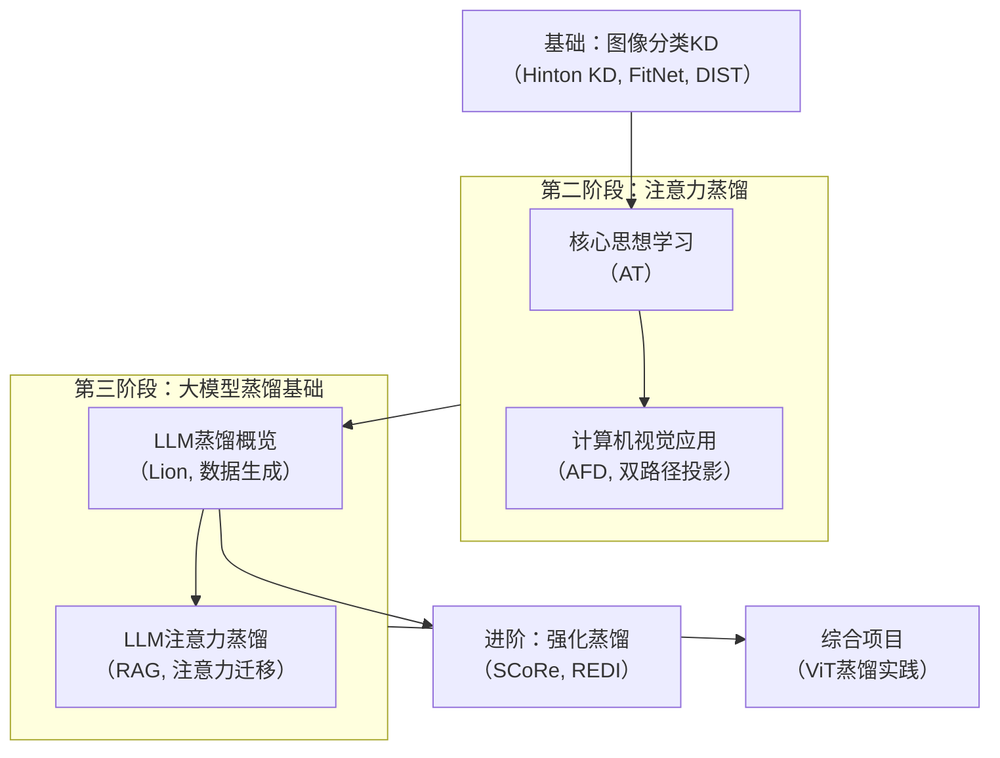

## 阶段一

- 蒸馏开山之作——引出了KD知识蒸馏
[[Hinton论文]]
- 特征引导——引出了特征部分的蒸馏学习
[[FitNet论文]]
- KD的优化DIST——针对于分类问题，优化了KD的损失函数为PCC
[[DIST论文]]

## 阶段二

- 注意力蒸馏AT——给出了注意力概念，给出新的注意力蒸馏办法
[[Attention Transfer]]
- Attention And Feature Transfer——给出了**推理过程**和推理信息信息的蒸馏方式
[[AFD论文]]

## 阶段三
- 大模型蒸馏BERT
[[Distill BERT]]
