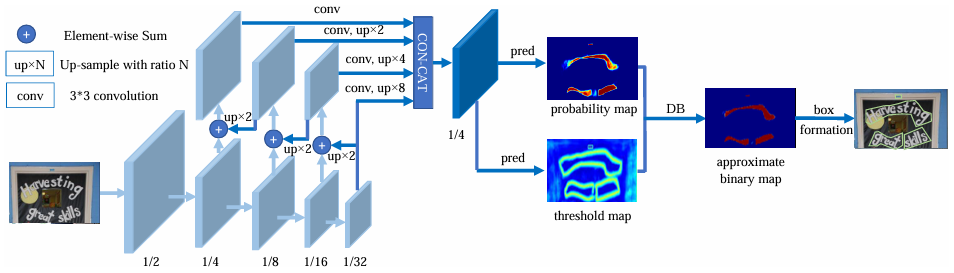

../图片/OCR/
## DB——文本检测算法
Differentiable Binarization（可微二值化），这个算法是基于场景文本检测算法提出来的。

### 传统算法
现有的检测算法两种
1. **回归**：直接在模型中预测出对应框的位置，类似于YOLO的目标框做法。后处理非常简单，但是模型比较复杂，训练比较难，局限于规则的文本框（容易包含背景等杂信息）
2. 分割：基于每一个像素的二分类问题。后处理非常复杂（离散的点需要汇集成一个区域，排除不良点，排除不良区域，规定区域的形状等）

针对于第二种办法，已有的做法是输出一个特征图，对应的是概率（叫做**概率图**），设定一个阈值，超过阈值就设置为正样本，反之亦然。但是出现问题
1. 无法反向传播：根据阈值判断破坏了计算图。
2. 手动设置阈值存在局限性。

### 特征金字塔
其实和YOLO的backbone类似，通过多个尺度的输出特征图来提取到不同细粒度的特征，然后加了一部汇集处理：
1. 每一个输出的特征图和下一个维度的特征图融合
2. 最终上采样成为相同尺寸的特征图之后进行融合，得到输出的特征图

### 输出头
输出分为两个部分
1. 概率图：每一个像素是文本的概率
2. 阈值图：每一个像素判断是否为阈值的值

阈值图提供的动态的阈值分配给每个像素，直观来讲
1. 阈值图是基于特征金字塔来分配的，已经能够学习到目标位置在什么地方
2. 基于1，我们通常给背景设置比较高的阈值（我们已经知道那个是背景了，为的就是减少干扰的出现）
3. 基于1，我们通常给文字设置比较低的阈值（为的是减少文字被排除的可能）

### 二值化
提出一种能够反向传播的二值化
$$F(p_{i,j}) = \frac{1}{1+\exp(-k\cdot (p_{i,j}-t_{i,j}))}$$
- K表示过渡态的宽度
- t是阈值图输出的值
- p是概率图输出的值
函数图像如下：

- 损失函数
$$L^+ = -\log(F(p_{i,j}))$$
$$L^-=-\log(1-F(p_{i,j}))$$

### label 生成
这是本文的另外一个亮点，他从直觉出发，优化了标签
1. 判断是否为文本，考虑文本的边缘，这个时候**阈值图**输出对应的卷积野完全是背景（这是我的理解），相比来说，将阈值设置在部分文本和部分背景的区域，显然更加合理，因为卷积能够识别到背景和文字同时存在，而不是只有背景一个信号，就能更好判断了。
2. 对应**概率图**，也只需要判断没有被阈值覆盖的小部分

- 阈值图只需要填充缩小后的概率图和扩大之后的阈值图之间的区域，根据到文字区域的距离来反比例赋值
- 概率图只需要在缩小后的概率图区域赋值
- 二值化图和概率图算法一样

恢复算法：
1. 在判断阈值图的背景时，引入算法 Vatti clipping algorithm算法，根据公式：  $D=\frac{Area(1-r^2)}{Length}$  r设置为0.4，利用D来拓展/缩小 阈值/概率图的区域。
2. 最终得到的二值化图，利用原算法拓展回去。就得到了结果

### 损失函数
对于三个图进行对准
1. 概率图
2. 阈值图
3. 二值化图

$$L=L_p + \alpha L_b + \beta L_t$$
- α设置1，β设置10
- 还需要用负样本采样，比例为1：3

## CLC
CLC算法是运用在未知长度的序列模型中，解决的是无法先知序列长度的模型，运用固定的输入长度来预测未知长度的目标后，对齐并且计算损失函数的算法。

### 难点
通常用于OCR和语言检测。
1. 由于OCR或者语言构建token的时候无法预知那一块对应一个文字，例如语音没办法提前预知一个字对应的长度，，OCR没法保证每一次切割都是一个字，因此只能笼统切割成预定好的一个个固定token
2. 固定数量token如何和目标序列**对齐**，目前的想法是多个token的输出可以对应y。

### 解决办法1
合并相同的输出

缺点
1. hello会把ll都给吞掉
2. 缺少空白字符

### 解决办法2
引入空白字符

1. 合并相同字符
2. 去掉空白字符

缺点
1. 不能保证相同的字符之间有空白字符来让我们不误合并

### 损失函数
目的肯定是使得正确对齐和合并（后文成为**并齐**）的所有路径（因为不止一条路径）的概率之和最大

$$L=\sum_{a∈A} \prod^{T}_{t=1}p_t(a_t|X)$$
- a代表了未并齐的输出，at表示输出的第t个时间步
- A是所有合格输出的总和

缺点
1. A来之不易，挑选A需要复杂度  $N^t$

幸好，我们使用动态规划

### 解决办法3
动态规划，我们顺便解决“解决办法2”之中的缺点，我们就需要规定在选择动态规划的策略的时候，不能够连续出现两个Y中相同的字符（说的很抽象看图）。
动态规划会计算所有状态，最后只需要拿合适的终态来输出就行了。

1. 动态规划是利用标签Y，在X输出的所有A之中，寻找所有正确的路径
2. 横坐标是不同的时间步，每一次转换状态，只能向右边一列，代表每一个时间步的选择
3. 纵坐标是标签Y，表示在Y的约束下，所有可能的路径

约束条件
1. 每一个Y的字符中间添加空白，考虑了所有可能出现的情况
2. 不能由Y的前一个字符直接跳转到下一个相同字符，会造成合并的失误
3. 可以计算出所有的状态的概率，只需取目标的最后两个输出；初态不符合条件的设置为0，可以防止前向传播了。

数学表达,  $a_{x,y}$  表示a的坐标位置
1.   $a_{x,y} ==a_{x,y-2}或者 NULL$  
$$a_{x,y} = P(a_{x,y}|X)\cdot (a_{x-1,y} + a_{x-1,y-1})$$
2. 其他情况
$$a_{x,y} = P(a_{x,y}|X)\cdot (a_{x-1,y} + a_{x-1,y-1} + a_{x-1,y-2})$$

初始条件
$$a_{0,1}或者a_{0,0}$$
最终概率
$$Res = a_{T,Y-1} + a_{T,Y}$$

- 损失函数
$$L = -\log(p(Y|X))$$
